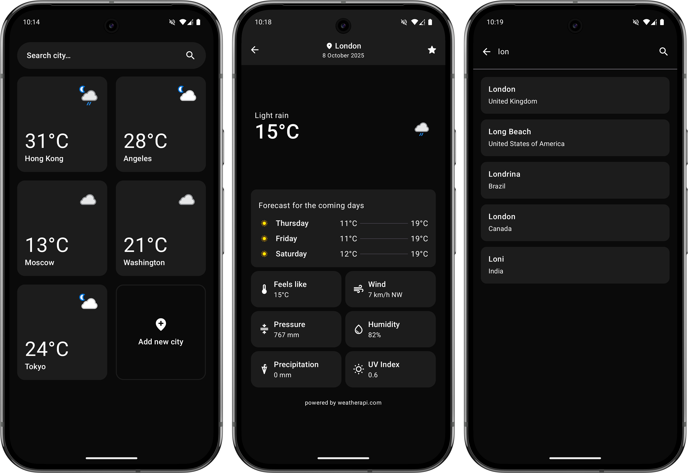
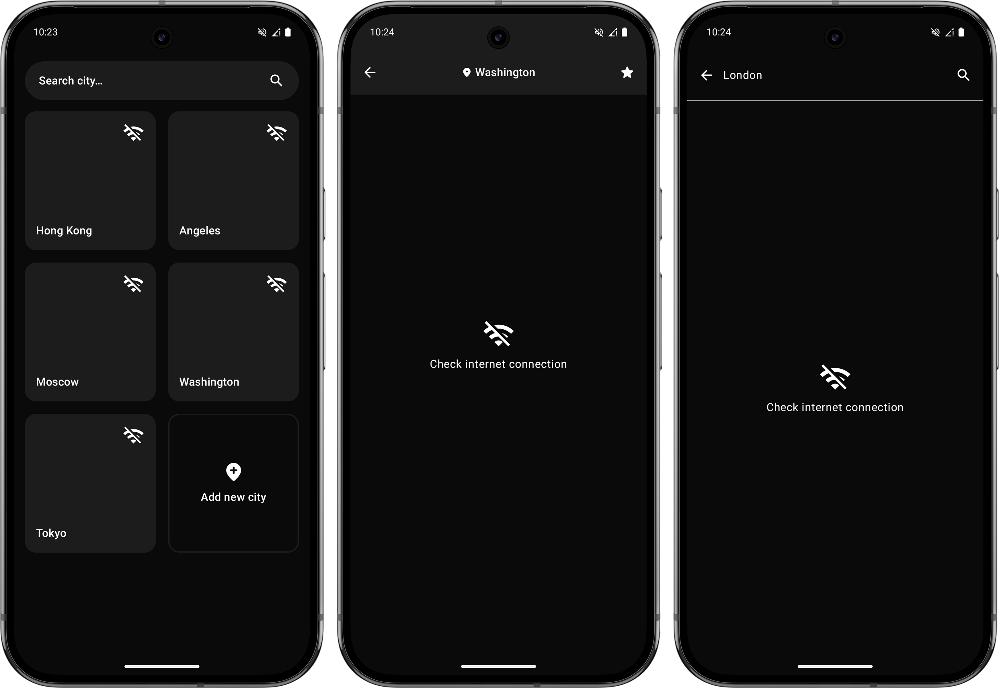

**WeatherCompose** — An Android weather forecast app based on [weatherapi.com](https://weatherapi.com/). This project was developed **for educational purposes** to strengthen skills.

## Features

*   **Favorites**: Add and remove cities to your favorites list for quick access.
*   **Global City Search**: Find any city using the search functionality, powered by API.
*   **Detailed Weather View**: Navigate to a dedicated screen for an in-depth look at the weather:
    *   Current and "feels like" temperature
    *   Weather conditions
    *   3-day forecast
    *   Wind speed and direction
    *   Atmospheric pressure
    *   Humidity
    *   Precipitation
    *   UV Index

## Screenshots

### Error Handling:


---

## Tech Stack & Architecture

*   **Architecture**: MVI (Model-View-Intent)
*   **Navigation**: Decompose
*   **Dependency Injection**: Dagger2
*   **Local Database**: Room
*   **Networking**: Retrofit2
*   **Async Operations**: Kotlin Coroutines & Flow

## Build and Run

1. Clone the repository:

    ```bash
    git clone git@github.com:Nu11Object/weather-compose-mvi.git
    ```
2. Create your own Weather API key:

   * Go to [WeatherApi](https://www.weatherapi.com/) and register.
   * Copy your API key from the [profile page](https://www.weatherapi.com/my/).
   * Specify it in **gradle.properties** like this:
   ```properties
   apikey=abc123456789
   ```
3. Build the project and run the application.
